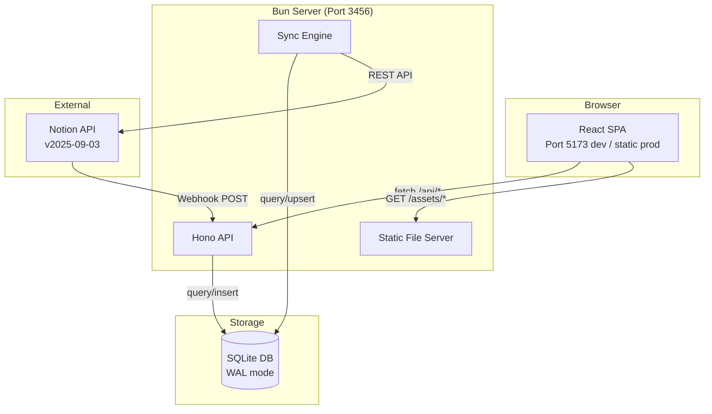

# Architecture Overview

High-level system design for the Task Management Analytics application.

## System Diagram



## Request Flow

```
Browser → GET /api/tasks
  → Auth middleware (Bearer token check)
  → getAllTasks(db) [JOIN tasks + pages, exclude soft-deleted]
  → JSON response: Task[]
```

## Sync Flow

```
Boot: empty DB? → Full sync → Start reconciliation loop → ready = true
          ↓
Every 15 min: Reconciliation (incremental query since last_sync_time)
          ↓
Real-time: Notion webhook → HMAC verify → fetchPage → upsert
```

## Key Architectural Decisions

### Single Container

One Bun process serves everything: static frontend, JSON API, webhook endpoint, and sync engine. This simplifies deployment and eliminates inter-service communication.

### No ORM

Raw SQL via `bun:sqlite`. The schema is simple (6 tables), and direct SQL provides clarity and performance without ORM abstraction overhead.

### Raw JSON Preservation

The complete Notion page response is stored in `pages.raw_json`. Typed tables (`tasks`, `projects`, `areas`) are denormalized extracts. This enables re-extraction if business logic changes, without re-fetching from Notion.

### Client-Side Analytics

All metrics (throughput, velocity, aging, etc.) are computed in the browser from the full task list. The server is a thin data layer:
- Simpler API (just return all records)
- No server-side aggregation logic to maintain
- Instant re-computation when time range changes
- Acceptable because dataset is small (hundreds, not millions)

### Soft Deletes

Pages are never hard-deleted. `deleted_at` timestamp provides audit trail and enables "undelete" via webhook events.

### Three-Layer Sync

Full sync + reconciliation + webhooks provides both completeness guarantees and real-time responsiveness. See [[sync-overview]] for details.

## Technology Rationale

| Choice | Rationale |
|--------|-----------|
| Bun | Fast startup, built-in SQLite, native TS execution |
| Hono | Lightweight, Web Standard API, minimal overhead |
| SQLite (WAL) | Zero-config, single file, fast reads, concurrent access |
| React Query | Smart caching eliminates custom state management |
| Recharts | React-native charts, good for business dashboards |
| Tailwind 4 | Utility-first, custom design system via @theme |

## Module Boundaries

```
server/
├── index.ts      ← Boot sequence, middleware, static serving
├── api/          ← HTTP route handlers (thin: validate → query → respond)
├── db/           ← Schema, store operations, queries
└── sync/         ← Notion client, full-sync, reconcile, webhook

src/
├── api/          ← Fetch client, React Query hooks, shared types
├── components/   ← UI layer (layout, primitives, shared)
├── contexts/     ← React Context (auth only)
├── lib/          ← Pure logic (metrics, constants, utilities)
└── pages/        ← Route components (compose hooks + components)
```
