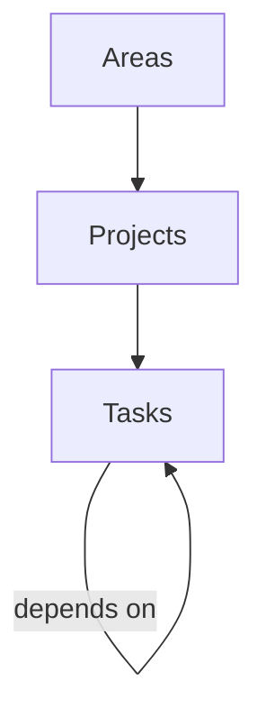

# Notion Data Sources

The system pulls data from three Notion databases that form a hierarchical task management system.

## Database Hierarchy



**Areas** → **Projects** → **Tasks** (with inter-task dependencies)

## Configured Databases

| Key | Database UUID | Purpose |
|-----|--------------|---------|
| `tasks` | `46f8ea4d-432a-4dd9-bc9a-dab4302c1cfe` | Individual actionable items with status, importance/urgency, dates, and project linkage |
| `projects` | `81899362-e971-4a82-ba25-18fdda1d8f63` | Multi-task initiatives with area linkage and date ranges |
| `areas` | `0b036eaf-a357-46ec-b479-b6bb88497b74` | Life/work areas that group projects |

**Source:** `DATA_SOURCES` constant in `server/sync/notion-client.ts`

## Relationships

- **Tasks → Projects**: A task can belong to one or more projects via the "Project" relation property. Stored as `project_ids` JSON array.
- **Projects → Areas**: A project can belong to one or more areas via the "Areas" relation property. Stored as `area_ids` JSON array.
- **Tasks → Tasks**: A task can depend on other tasks via the "Depends on" relation property. Stored as `dependencies` JSON array.

## Reverse Lookup

The system also maintains a `REVERSE_DATA_SOURCES` map (UUID → key) for webhook processing — when Notion sends a page event, the parent database UUID is used to determine which typed table to update.

## Changing Database UUIDs

If the Notion databases are recreated or moved:

1. Update the `DATA_SOURCES` map in `server/sync/notion-client.ts`
2. Clear the existing database (delete `data/analytics.db`)
3. Restart the server to trigger a fresh full sync

## API Endpoint

All queries use the Notion Data Sources API:
```
POST https://api.notion.com/v1/data_sources/{dataSourceId}/query
```

This endpoint requires a Notion integration with access to the target databases.
