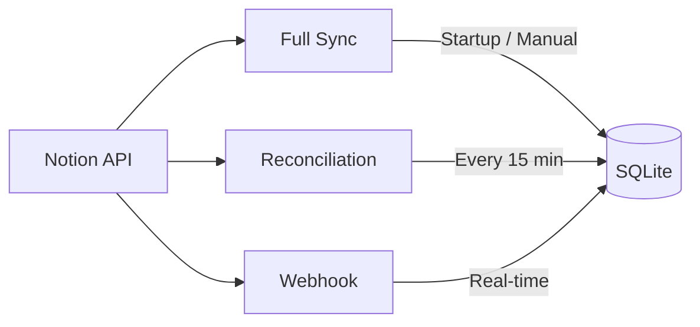

# Sync System

A three-layer synchronization architecture that keeps local SQLite data in sync with Notion databases.

**Entry point:** `server/sync/index.ts`

## Architecture

## Contents

- [[sync-overview]] — Three-layer design, boot sequence, and sync mutex
- [[full-sync]] — Complete database re-sync from Notion
- [[reconciliation-loop]] — Incremental 15-minute polling
- [[webhook-handler]] — Real-time updates with HMAC verification
- [[notion-client]] — Notion API wrapper with pagination and retry logic
