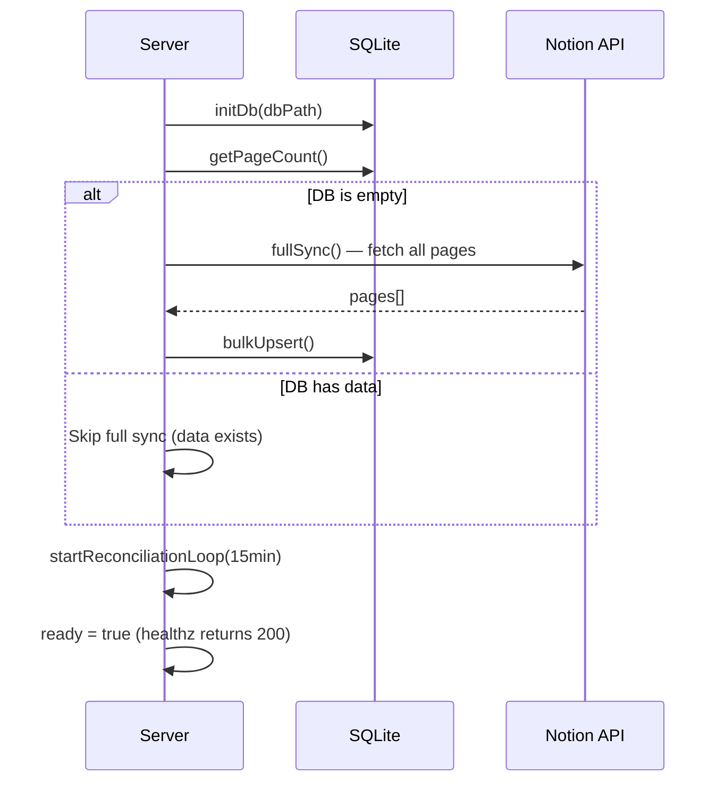

# Sync Architecture Overview

The synchronization system uses three complementary layers to keep local data consistent with Notion, each optimized for different scenarios.

**Source:** `server/sync/index.ts`, `server/index.ts`

## Three-Layer Design

| Layer | Trigger | Scope | Latency |
|-------|---------|-------|---------|
| [[full-sync]] | Startup (empty DB), manual `POST /api/sync` | All pages from all databases | Minutes |
| [[reconciliation-loop]] | Every 15 minutes (setInterval) | Pages modified since `last_sync_time` | Seconds per change |
| [[webhook-handler]] | Notion sends POST to `/api/webhooks/notion` | Single page per event | Near real-time |

## Why Three Layers?

- **Full sync** provides the baseline truth and handles initial population
- **Reconciliation** catches any events missed by webhooks (network issues, downtime) and detects changes the webhook doesn't cover
- **Webhooks** provide immediate feedback for active editing sessions

## Sync Mutex

A global `syncing` boolean flag prevents concurrent sync operations:

```typescript
let syncing = false;

export async function fullSync(db) {
  if (syncing) return;  // Skip if already running
  syncing = true;
  try { await _fullSync(db); }
  finally { syncing = false; }
}
```

Both `fullSync()` and `reconcile()` check this flag. If a reconciliation fires while a full sync is running, it's silently skipped.

## Boot Sequence



1. Initialize database (create tables if needed)
2. Check if database is empty
3. If empty: run full sync (blocking — server returns 503 until done)
4. Start reconciliation timer (15-minute interval)
5. Set `ready = true` — health check now passes

## Graceful Shutdown

On `SIGTERM` or `SIGINT`:
1. Clear reconciliation timer
2. Close database connection
3. Exit process

## Metadata Tracking

All sync operations update `sync_meta` keys:

| Key | Set by | Purpose |
|-----|--------|---------|
| `last_full_sync` | Full sync | Timestamp of last complete sync |
| `last_reconciliation` | Reconciliation | Timestamp of last reconciliation run |
| `last_webhook` | Webhook handler | Timestamp of last processed webhook |
| `last_sync_time` | Full sync + Reconciliation | Used as the "since" filter for incremental queries |
| `webhook_verification_token` | Webhook handler | HMAC secret for signature validation |

## Event Audit Trail

Every sync operation logs to `sync_events`:

```json
{ "event_type": "full_sync", "source": "startup", "payload": { "totalPages": 142, "elapsed": 3200 } }
{ "event_type": "reconciliation", "source": "scheduled", "payload": { "totalUpdated": 3, "elapsed": 800 } }
{ "event_type": "webhook", "source": "notion_webhook", "payload": { "type": "page.updated", "entityId": "abc123" } }
{ "event_type": "error", "source": "reconciliation", "payload": { "error": "Notion API error 500" } }
```
