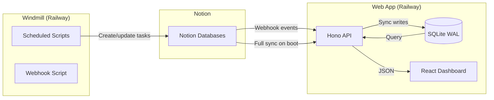

# Architecture

## Monorepo Structure

```
my-task-management/
├── app/            # Full-stack web application
│   ├── server/     # Hono API + SQLite + sync engine
│   └── src/        # React 19 SPA (Vite)
├── automation/     # Windmill scripts (Notion task automation)
│   └── f/          # Windmill resource tree
└── docs/           # This documentation vault
```

## Data Flow Overview



## App Architecture

The web application runs on **Bun** with:

- **Hono 4.x** — Lightweight HTTP framework serving both API routes and the static SPA
- **SQLite (bun:sqlite)** — Embedded database in WAL mode for concurrent reads during writes
- **React 19 SPA** — Client-side dashboard built with Vite 8, served as static assets
- **Single-binary deployment** — Multi-stage Docker build produces a slim Bun container

### Three-Layer Sync Strategy

| Layer | Trigger | Purpose |
|-------|---------|---------|
| Full sync | App boot | Hydrate SQLite from Notion — complete source of truth |
| Reconciliation | Every 15 minutes | Catch missed webhooks, repair drift |
| Webhooks | Real-time (Notion push) | Immediate updates for task changes |

## Automation Architecture

Windmill CE runs on Railway with **4 scripts**:

| Script | Trigger | Purpose |
|--------|---------|---------|
| `create_repetitive_tasks` | Cron (daily) | Generate recurring tasks in Notion |
| `create_weekly_note` | Cron (weekly) | Create weekly planning page |
| `set_task_init_date` | Cron (periodic) | Backfill initialisation dates |
| `update_legacy_tasks` | Webhook | Migrate legacy task properties |

Scripts run in **Bun runtime** within Windmill workers and interact with the Notion API (v2025-09-03).

## Key Design Decisions

- **SQLite over Postgres** — Single-node deployment, simpler ops, WAL mode handles the read-heavy dashboard workload.
- **Event-driven sync** — Webhooks provide near-real-time updates; reconciliation handles edge cases.
- **Monorepo** — Shared documentation and coordinated deployment for tightly coupled systems.
