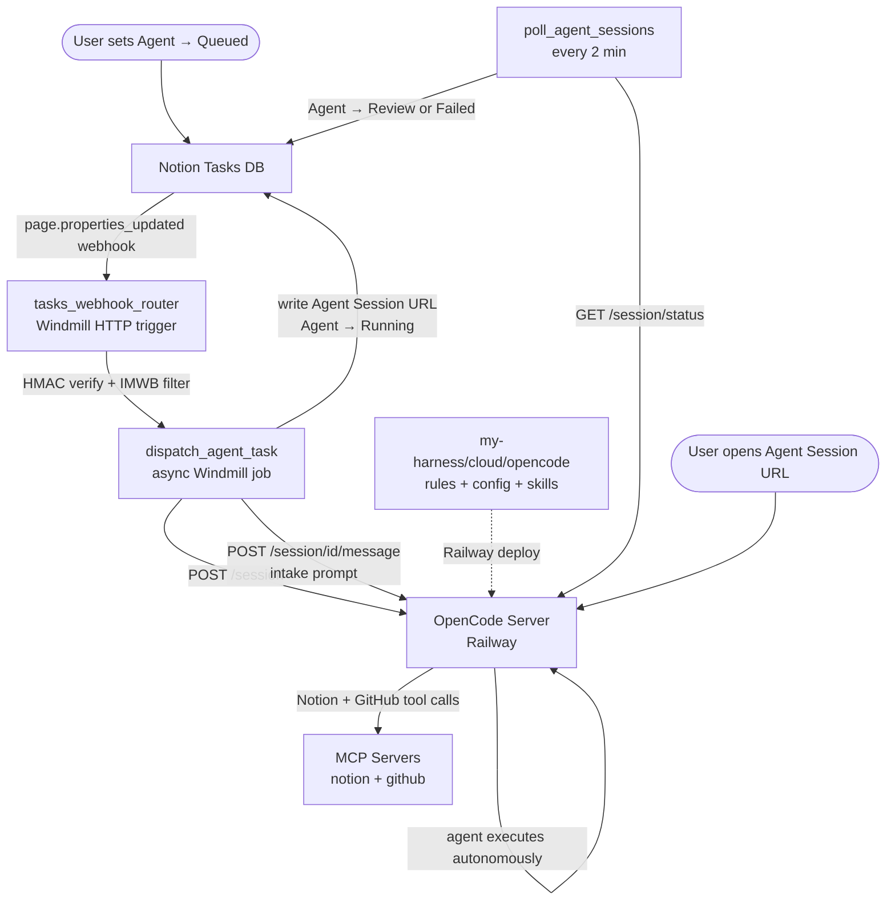
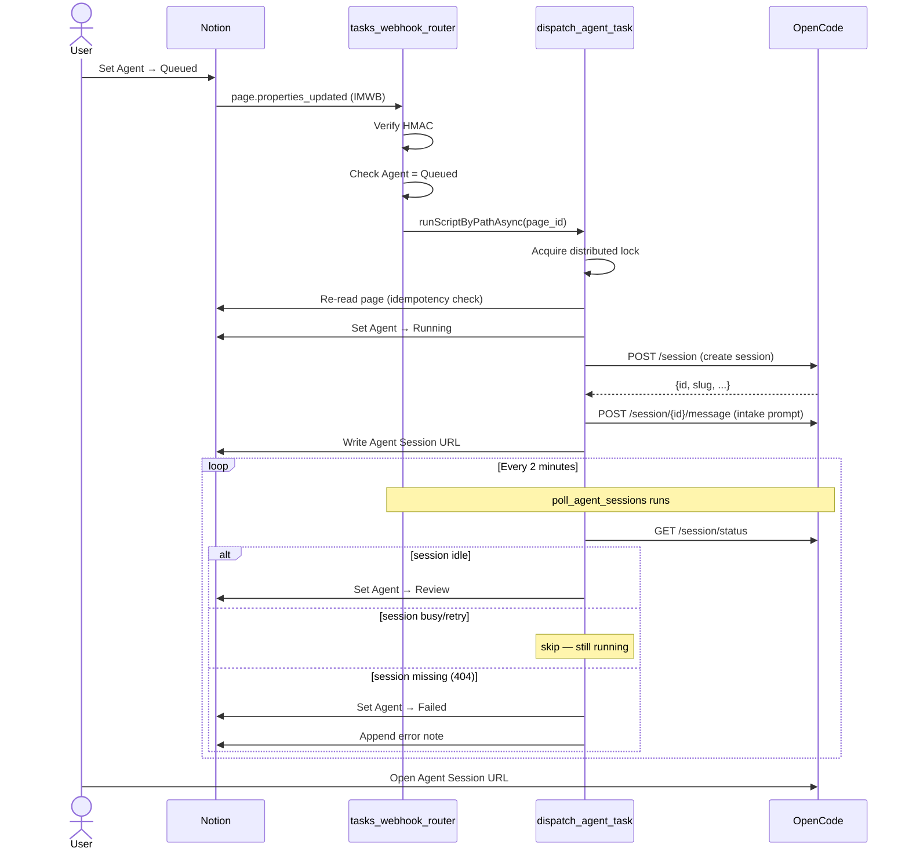

# Agent Orchestration Architecture

## Data Flow

## Sequence Diagram

## Component Table

| Component | Runtime | Trigger | Location |
|-----------|---------|---------|---------|
| `tasks_webhook_router` | Bun (Windmill) | HTTP POST from Notion | `automation/f/notion_tasks/tasks_webhook_router.ts` |
| `dispatch_agent_task` | Bun (Windmill) | Async job from router | `automation/f/notion_tasks/dispatch_agent_task.ts` |
| `poll_agent_sessions` | Bun (Windmill) | Cron `0 */2 * * * *` UTC | `automation/f/notion_tasks/poll_agent_sessions.ts` |
| OpenCode server | Railway container | REST API and web UI | `https://opencode-production-4c1e.up.railway.app` |
| Cloud OpenCode harness | `my-harness` | Git push / Railway deploy | `cloud/opencode/` |
| OpenCode MCP servers | OpenCode global config | Tool calls from agent | `notion`, `github` |
| Notion Tasks DB | Notion | User action / API writes | `database_id: a43c2d3d-11e5-4a66-be42-dd411a1d9727` |

## Key Design Decisions

**Async dispatch, not inline** — The webhook router returns quickly by submitting an async Windmill job for session creation. This keeps the HTTP trigger within Notion's webhook timeout window regardless of OpenCode response time.

**Notion state as the primary duplicate guard** — Before creating a session, the dispatch script re-reads the Notion page and aborts if `Agent ≠ Queued`. This provides a hard idempotency guarantee even if the distributed lock races are lost.

**Agent → Running set before session creation** — If session creation fails, the catch block sets `Agent → Failed`. Setting Running first means the page never stays stuck in `Queued` with a half-created session.

**Poller aborts on status fetch failure** — A non-OK response from `GET /session/status` causes the entire poll run to abort rather than misclassifying active sessions as idle.

**Session URL uses `/Lw/session/{id}`** — The `/s/{slug}` URL format resolves to a different session in the browser due to slug reuse. The `/Lw/session/{id}` format navigates directly by session ID and is reliable.

**Cloud worker config lives in `my-harness`** — OpenCode runtime behavior,
skills, permissions, and MCP servers are maintained in
`my-harness/cloud/opencode/`. This repo owns Windmill dispatch and polling
logic; the harness repo owns the hosted agent environment.

**MCPs are global OpenCode config** — The Railway worker installs
`opencode.jsonc` into `/root/.config/opencode/` on startup, so Notion and GitHub
MCPs are available to hosted sessions even if the current web UI does not
display them correctly.
