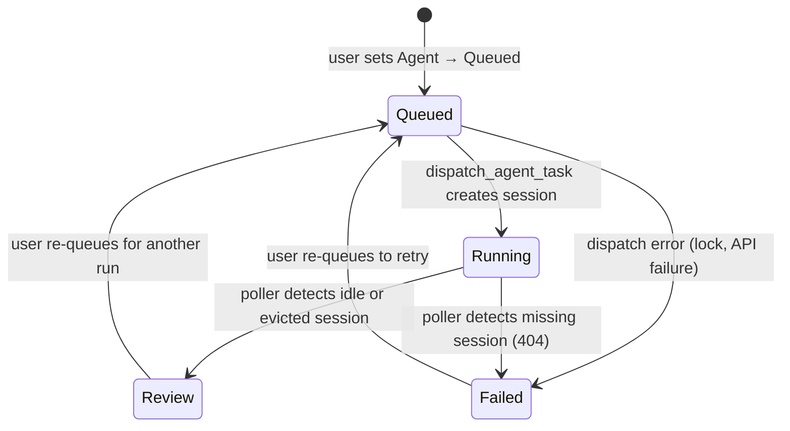

# Agent State Machine

The `Agent` property on a Notion task tracks the lifecycle of an autonomous agent execution. It is independent of the task `Status` property.

## States

## State Reference

| State | Set By | Meaning |
|-------|--------|---------|
| **Queued** | User (manual) | Task is ready for agent pickup. Triggers the dispatch pipeline via webhook. |
| **Running** | `dispatch_agent_task` | OpenCode session created and intake prompt sent. Agent is working. |
| **Review** | `poll_agent_sessions` | Agent has finished (session idle or evicted from status map). Human review needed. |
| **Failed** | `dispatch_agent_task` or `poll_agent_sessions` | An error occurred — session creation failed, or session is missing (404) on OpenCode. |

## Transition Rules

### Queued → Running

Triggered when `dispatch_agent_task` successfully:
1. Acquires the distributed lock
2. Confirms `Agent = Queued` on re-read
3. Creates the OpenCode session
4. Sends the intake prompt

`Running` is set **before** session creation to act as the primary duplicate guard.

### Queued → Failed

If `dispatch_agent_task` throws at any point (lock race, Notion API error, OpenCode API error), the catch block sets `Agent → Failed`.

### Running → Review

`poll_agent_sessions` sets Review when:
- `GET /session/status` returns `{type: "idle"}` for the session ID, **or**
- Session is absent from the status map but `GET /session/{id}` returns 200 (session evicted after completion)

### Running → Failed

`poll_agent_sessions` sets Failed when:
- `GET /session/{id}` returns 404 (session does not exist on OpenCode)

An error note is also appended to the task page body.

## Duplicate Dispatch Prevention

Two guards prevent the same task from being dispatched twice:

1. **Distributed lock** — `wmill.setState` at key `f/notion_tasks/dispatch_lock_{pageId}` with 120s TTL and owner tracking. A read-back after 200ms confirms ownership before proceeding.
2. **Notion re-read** — After acquiring the lock, the dispatch script reads the live Notion page and skips if `Agent ≠ Queued`. Since the first successful dispatch sets `Agent → Running`, any concurrent duplicate will see `Running` and exit.

The lock alone is not sufficient (Windmill state is eventually consistent). The Notion re-read is the hard guard.

## Agent Property vs. Task Status

The `Agent` property is orthogonal to the task `Status` property. A task can be `In Progress` (Status) and `Review` (Agent) simultaneously — the agent finished its work, but the human hasn't closed the task yet. Neither property's automation interferes with the other.
