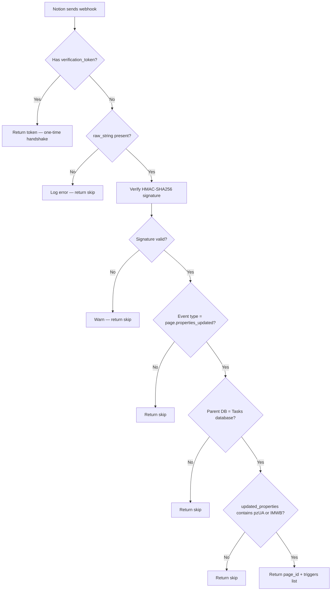

# Webhook Integration

How the Notion webhook pipeline detects `Agent → Queued` changes and triggers the dispatch script.

## Preprocessor Flow



## HMAC Verification

Notion signs every webhook payload with `HMAC-SHA256` using the webhook secret. The signature is sent in the `X-Notion-Signature` header (format: `sha256={hex}`).

Verification requires the **raw unparsed request body** — not the parsed JSON object — because any whitespace normalization would invalidate the signature.

Windmill exposes the raw body via `event.raw_string` when the HTTP trigger is configured with `raw_string: true` in its YAML:

```yaml
raw_string: true
```

The verification function:

```typescript
function verifyHmac(rawBody, signature, secret): boolean {
  const hmac = createHmac("sha256", secret);
  hmac.update(rawBody);
  const expected = hmac.digest("hex");
  const actual = signature.startsWith("sha256=") ? signature.slice(7) : signature;
  return timingSafeEqual(Buffer.from(expected), Buffer.from(actual));
}
```

`timingSafeEqual` prevents timing attacks. If the secret is wrong or missing, all webhooks fail verification and are silently skipped.

The webhook secret is stored as a Windmill variable at `f/notion_tasks/notion_webhook_secret`.

## Property ID Routing

The preprocessor inspects `data.updated_properties` (an array of Notion property IDs) and maps them to handler triggers:

| Property ID | Property Name | Trigger |
|-------------|---------------|---------|
| `pzUA` | Status | `lifecycle` |
| `IMWB` | Agent | `agent_dispatch` |

Multiple triggers can fire from a single webhook if both properties were updated simultaneously.

## Agent Dispatch Handler

`handleAgentDispatch` runs in `main` when the `agent_dispatch` trigger is present. It:

1. Reads the `Agent` property value from the already-fetched Notion page
2. Skips if `Agent ≠ Queued` (guard against non-Queued Agent changes triggering dispatch)
3. Calls `wmill.runScriptByPathAsync("f/notion_tasks/dispatch_agent_task", { page_id })`

`runScriptByPathAsync` submits the dispatch job and returns a job ID immediately — the webhook response does not wait for session creation to complete.

## Bounce-Back Prevention

Writing `Agent → Running` in the dispatch script triggers a new `page.properties_updated` webhook from Notion. However, `IMWB` will be in `updated_properties` again. The `handleAgentDispatch` handler then reads the live `Agent` value (`Running`) and skips because it is not `Queued`. No infinite loop is possible.

## Database ID Validation

The preprocessor normalizes both the target database ID and the incoming `data.parent.id` to lowercase hex (hyphens stripped) before comparison:

```typescript
const TASKS_DATABASE_ID_NORMALIZED = "a43c2d3d11e54a66be42dd411a1d9727";
normalizeUuid(parent.id) !== TASKS_DATABASE_ID_NORMALIZED
```

This ensures the webhook only processes events from the Tasks database even if Notion changes UUID formatting.
