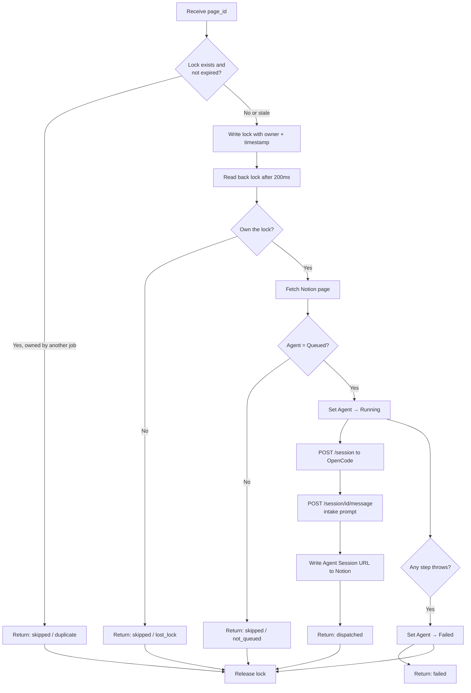

# Dispatch Agent Task

Windmill script that creates an OpenCode session for a Queued task, sends the intake prompt, and writes the session URL back to Notion.

## Overview

| Attribute | Value |
|-----------|-------|
| **Script** | `f/notion_tasks/dispatch_agent_task` |
| **Trigger** | Async Windmill job submitted by `handleAgentDispatch` in `tasks_webhook_router` |
| **Input** | `page_id` — Notion page ID of the task |
| **Runtime** | Bun (Windmill) |

## Execution Flow



## Distributed Lock

The lock prevents duplicate sessions when Notion fires duplicate webhooks (which can happen on rapid property changes).

| Property | Value |
|----------|-------|
| **State key** | `f/notion_tasks/dispatch_lock_{pageIdNoHyphens}` |
| **TTL** | 120,000 ms (2 minutes) |
| **Owner** | `process.env.WM_JOB_ID` (or `job-{Date.now()}` fallback) |
| **Read-back delay** | 200ms after writing, to reduce (not eliminate) race window |
| **Release** | `finally` block — always released, even on error |

The key uses the `f/notion_tasks/` folder prefix because Windmill's `setState` stores values as resources and requires a valid resource path with a folder prefix. Hyphens are stripped from the page ID because they are not allowed in resource path segments.

## Idempotency Check

After acquiring the lock, the script re-reads the Notion page live and exits if `Agent ≠ Queued`. This is the **hard guard** — since a successful dispatch immediately sets `Agent → Running`, any duplicate that wins the lock race will see `Running` and abort cleanly.

## Session Creation

```
POST {base_url}/session
Content-Type: application/json
Authorization: Basic {credentials}

{
  "title": "{taskName}",
  "model": { "id": "gpt-5.4", "providerID": "openai" }
}
```

The response body is JSON immediately followed by HTML (`<!doctype html>...`). The script parses only the JSON prefix by slicing at the `<!doctype` boundary:

```typescript
const sessionBody = await sessionRes.text();
const session = JSON.parse(
  sessionBody.slice(0, sessionBody.indexOf("<!doctype") > 0
    ? sessionBody.indexOf("<!doctype")
    : undefined)
);
```

## Prompt Delivery

The intake prompt is sent as the first message to the session using the legacy message endpoint:

```
POST {base_url}/session/{sessionId}/message
Content-Type: application/json
Authorization: Basic {credentials}

{
  "parts": [{ "type": "text", "text": "{intakePrompt}" }]
}
```

This triggers the agent to start working immediately. See [[OpenCode Integration]] for why the V2 `/api/session/{id}/prompt` endpoint is not used.

## Intake Prompt Structure

The prompt instructs the agent to work autonomously on behalf of Geoff Li:

```
You are an autonomous agent working on behalf of Geoff Li.

## Task
**Name:** {taskName}

## Task Description
{pageBody}          ← first 2000 chars of paragraph blocks

## Instructions
- Work autonomously. When done or blocked, say so clearly.
- Coding tasks: clone repo, create branch, push. Do not push to main.
- Research tasks: produce a structured document, summarize findings.
- If blocked, describe exactly what you need and stop.

## Guardrails
- Do not commit credentials, secrets, or personal data.
- Do not delete production resources.
- Do not send messages or emails on Geoff's behalf.
- Do not purchase or subscribe to anything.
```

Page body is extracted from `paragraph` blocks only (up to 2000 characters). If no paragraphs exist, `"(No description provided.)"` is used.

## Session URL

The URL written to the Notion `Agent Session` property uses the direct session ID path:

```
{base_url}/Lw/session/{sessionId}
```

The `/s/{slug}` format is not used — browser navigation by slug resolves to whichever session currently holds that slug, which can change over time.

## Error Handling

Any exception in the try block causes the catch block to set `Agent → Failed` in Notion. The `finally` block always releases the lock, regardless of outcome. If the Notion update in the catch block also fails, it is silently swallowed to ensure the lock is still released.

## Constants

| Constant | Value |
|----------|-------|
| `OPENCODE_MODEL` | `{ id: "gpt-5.4", providerID: "openai" }` |
| `PROP_AGENT` | `"Agent"` |
| `PROP_AGENT_SESSION` | `"Agent Session"` |
| `PROP_TASK_NAME` | `"Task Name"` |
| `STATUS_QUEUED` | `"Queued"` |
| `STATUS_RUNNING` | `"Running"` |
| `STATUS_FAILED` | `"Failed"` |
| Lock TTL | `120_000` ms |
