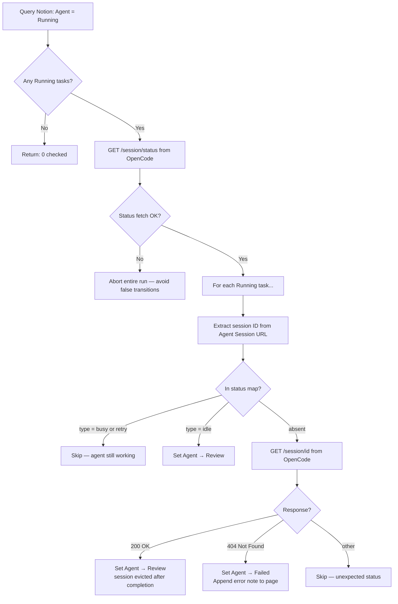

# Poll Agent Sessions

Windmill scheduled script that checks OpenCode for completed sessions and transitions Notion tasks from `Running` to `Review` or `Failed`.

## Overview

| Attribute | Value |
|-----------|-------|
| **Script** | `f/notion_tasks/poll_agent_sessions` |
| **Trigger** | Cron — every 2 minutes |
| **Schedule** | `0 */2 * * * *` (UTC) |
| **No-overlap** | `no_flow_overlap: true` — skips if a prior run is still active |
| **Input** | None |
| **Runtime** | Bun (Windmill) |

## Polling Logic



## Session ID Extraction

The poller extracts the session ID from the `Agent Session` URL stored in Notion. The URL format is `{base_url}/Lw/session/{sessionId}`. The ID is the last path segment and begins with `ses_`:

```typescript
const segments = u.pathname.split("/").filter(Boolean);
const lastSegment = segments[segments.length - 1];
sessionId = (lastSegment && lastSegment.startsWith("ses_"))
  ? lastSegment
  : u.searchParams.get("sid");  // fallback for legacy URLs
```

## Status Map Interpretation

`GET /session/status` returns a map of only the **currently active** sessions:

```json
{
  "ses_abc123": { "type": "idle" },
  "ses_def456": { "type": "busy" },
  "ses_ghi789": { "type": "retry" }
}
```

Sessions that have **finished and been evicted** are absent from the map. A session absent from the map is therefore ambiguous — it could be done or could have never started. The script always verifies with a direct `GET /session/{id}` before concluding.

| Status | Action |
|--------|--------|
| `busy` | Agent is actively executing — leave as Running |
| `retry` | Agent is retrying a failed tool call — leave as Running |
| `idle` | Agent has stopped — set Review |
| absent + 200 | Session exists but evicted (finished) — set Review |
| absent + 404 | Session not found — set Failed + error note |
| absent + other | Unexpected — skip, log warning |

## Abort on Status Fetch Failure

If `GET /session/status` returns a non-OK response, the entire poll run aborts immediately. This is intentional: without the status map, the poller cannot distinguish `idle` from `busy`, so any transition would risk a false positive (setting a still-running task to Review). An aborted run is logged with `aborted: true` in the return value.

## Error Note Format

When a session is not found (404), the poller appends two blocks to the task page:

```
## Agent Output

Error: OpenCode session not found ({sessionId})
```

This gives Geoff visibility into why the task failed without requiring a Windmill log lookup.

## Return Value

```typescript
{
  checked: number,    // total Running tasks evaluated
  set_review: number, // tasks transitioned to Review
  set_failed: number, // tasks transitioned to Failed
  skipped: number,    // tasks left as Running (busy/retry/unexpected)
  aborted?: true      // present only when status fetch failed
}
```

## Concurrency

All task evaluations run in parallel via `Promise.all`. Each task's Notion update and OpenCode verification are independent. The `no_flow_overlap` schedule setting prevents multiple poller instances from running simultaneously, which avoids double-transitions if one poll run takes longer than 2 minutes.
