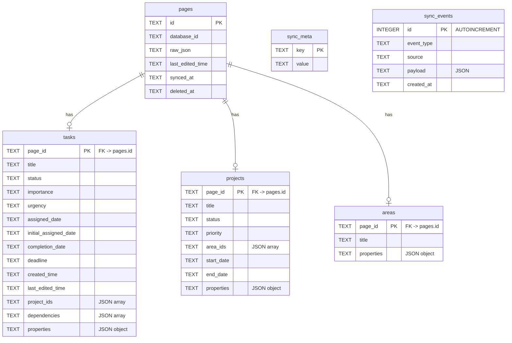

# Database Schema

SQLite database with WAL mode, stored at the path configured by `DB_PATH` (default: `./data/analytics.db`).

**Source:** `app/server/db/schema.ts`

## PRAGMA Configuration

```sql
PRAGMA journal_mode = WAL;      -- Write-ahead logging for concurrent reads
PRAGMA busy_timeout = 5000;     -- Wait up to 5s for locked tables
PRAGMA foreign_keys = ON;       -- Enforce referential integrity
```

## Entity-Relationship Diagram



## Tables

### `pages` — Raw Notion Page Cache

Stores the complete Notion page object as JSON alongside metadata. Serves as the authoritative cache layer.

| Column | Type | Constraints | Description |
|--------|------|-------------|-------------|
| `id` | TEXT | PRIMARY KEY | Notion page UUID |
| `database_id` | TEXT | NOT NULL | Source database: `tasks`, `projects`, or `areas` |
| `raw_json` | TEXT | NOT NULL | Full Notion page object (JSON-stringified) |
| `last_edited_time` | TEXT | NOT NULL | Notion's `last_edited_time` ISO string |
| `synced_at` | TEXT | NOT NULL | When this page was last synced |
| `deleted_at` | TEXT | nullable | Soft-delete timestamp (NULL = active) |

### `tasks` — Denormalized Task Data

Extracted task-specific fields for fast querying. Foreign key to `pages` with CASCADE delete.

| Column | Type | Description |
|--------|------|-------------|
| `page_id` | TEXT (PK, FK) | References `pages.id` |
| `title` | TEXT | Task name |
| `status` | TEXT | Not Started, In Progress, Done, Cancelled, Blocked |
| `importance` | TEXT | High, Medium, Low |
| `urgency` | TEXT | High, Medium, Low (nullable) |
| `assigned_date` | TEXT | ISO date — when task is scheduled |
| `initial_assigned_date` | TEXT | ISO date — original schedule (for reschedule tracking) |
| `started_date` | TEXT | ISO date — when first moved to In Progress (auto-set by webhook) |
| `completion_date` | TEXT | ISO date — when closed (Done or Cancelled, auto-set by webhook) |
| `deadline` | TEXT | ISO date — hard due date |
| `created_time` | TEXT | Notion creation timestamp |
| `last_edited_time` | TEXT | Notion last edit timestamp |
| `project_ids` | TEXT | JSON array of project page IDs |
| `dependencies` | TEXT | JSON array of blocking task page IDs |
| `properties` | TEXT | JSON object of remaining Notion properties |

### `projects` — Denormalized Project Data

| Column | Type | Description |
|--------|------|-------------|
| `page_id` | TEXT (PK, FK) | References `pages.id` |
| `title` | TEXT | Project name |
| `status` | TEXT | In Progress, Completed |
| `priority` | TEXT | High, Medium, Low |
| `area_ids` | TEXT | JSON array of area page IDs |
| `start_date` | TEXT | ISO date — project start |
| `end_date` | TEXT | ISO date — project end |
| `properties` | TEXT | JSON object of remaining properties |

### `areas` — Denormalized Area Data

| Column | Type | Description |
|--------|------|-------------|
| `page_id` | TEXT (PK, FK) | References `pages.id` |
| `title` | TEXT | Area name |
| `properties` | TEXT | JSON object of remaining properties |

### `sync_meta` — Sync State Key-Value Store

| Column | Type | Description |
|--------|------|-------------|
| `key` | TEXT (PK) | Metadata key |
| `value` | TEXT | Stored value |

**Known keys:** `last_full_sync`, `last_reconciliation`, `last_webhook`, `last_sync_time`, `webhook_verification_token`

### `sync_events` — Audit Log

| Column | Type | Description |
|--------|------|-------------|
| `id` | INTEGER (PK) | Auto-incrementing ID |
| `event_type` | TEXT (NOT NULL) | `full_sync`, `reconciliation`, `webhook`, `webhook_verification`, `error` |
| `source` | TEXT (NOT NULL) | `startup`, `scheduled`, `notion_webhook`, `manual_sync` |
| `payload` | TEXT | JSON with event-specific details |
| `created_at` | TEXT (NOT NULL) | Auto-set to `datetime('now')` |

## Indexes

| Index | Table | Column(s) | Purpose |
|-------|-------|-----------|---------|
| `idx_pages_database_id` | pages | database_id | Filter pages by source database |
| `idx_pages_last_edited_time` | pages | last_edited_time | Incremental sync queries |
| `idx_pages_deleted_at` | pages | deleted_at | Fast exclusion of soft-deleted pages |
| `idx_tasks_status` | tasks | status | Filter by task status |
| `idx_tasks_assigned_date` | tasks | assigned_date | Date-range queries |
| `idx_tasks_deadline` | tasks | deadline | Deadline proximity queries |
| `idx_sync_events_created_at` | sync_events | created_at | Paginated event log |

## Design Decisions

- **Soft deletes with pruning** — Pages are soft-deleted by setting `deleted_at`. Soft-deleted pages older than 90 days are permanently purged during reconciliation (CASCADE deletes remove typed rows). If a purged page is later undeleted in Notion, the webhook handler re-fetches and re-inserts it.
- **Raw JSON preservation** — The full Notion response is stored in `pages.raw_json`, enabling re-extraction if the schema evolves.
- **JSON arrays in TEXT columns** — Relation IDs (`project_ids`, `dependencies`, `area_ids`) are stored as JSON-stringified arrays. Parsed at query time.
- **CASCADE deletes on FK** — If a page record is ever hard-deleted, its typed row is automatically removed.
