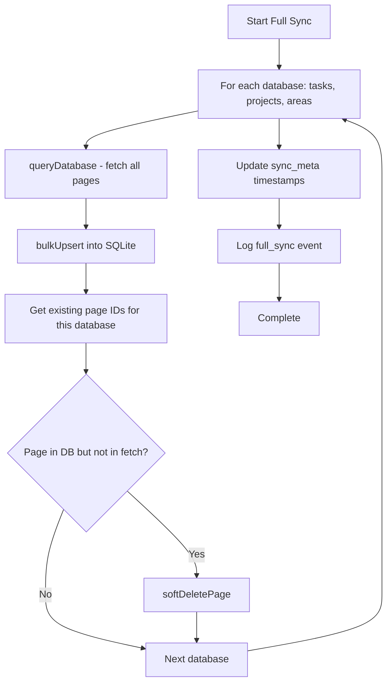

# Full Sync

Fetches all pages from all three Notion databases and performs a complete reconciliation against the local SQLite store.

**Source:** `app/server/sync/full-sync.ts`

## When It Runs

1. **Startup** — Automatically if the database is empty (no tasks, projects, or areas)
2. **Manual trigger** — `POST /api/sync` endpoint

## Process



### Step-by-Step

1. **Get Notion API key** via `getNotionKey()`
2. **For each database** (tasks, projects, areas):
   - Call `queryDatabase()` to fetch all pages (paginated, 100 per page, 350ms inter-page delay)
   - Convert to `RawPage[]` format (id, database_id, raw_json, last_edited_time)
   - Call `bulkUpsert()` to INSERT OR REPLACE all pages in a transaction
   - Get all existing page IDs for this database from SQLite
   - Soft-delete any IDs present in DB but absent from the fetched set
3. **Update metadata:**
   - `last_full_sync` -> current ISO timestamp
   - `last_sync_time` -> sync start time (used by reconciliation as "since" filter)
4. **Log event** with total page count and elapsed milliseconds

## Soft-Delete Detection

After upserting all fetched pages for a database, the sync compares fetched IDs to existing IDs:

```typescript
const existingIds = getAllPageIds(db, dbName);
const fetchedIds = new Set(pages.map(p => p.id));
for (const existingId of existingIds) {
  if (!fetchedIds.has(existingId)) {
    softDeletePage(db, existingId);
  }
}
```

Pages removed from Notion are marked with `deleted_at` timestamp — never hard-deleted.

## Performance Characteristics

- **Network time** dominates — each database requires paginated API calls with 350ms delays
- **Database writes** use `bulkUpsert()` (single transaction) for efficiency
- **Typical duration**: 2-5 seconds for ~100-200 total pages

## Error Handling

- On startup: fatal error halts the boot process (exits with code 1)
- On manual trigger: error is caught, logged to `sync_events`, and returned as HTTP 500
