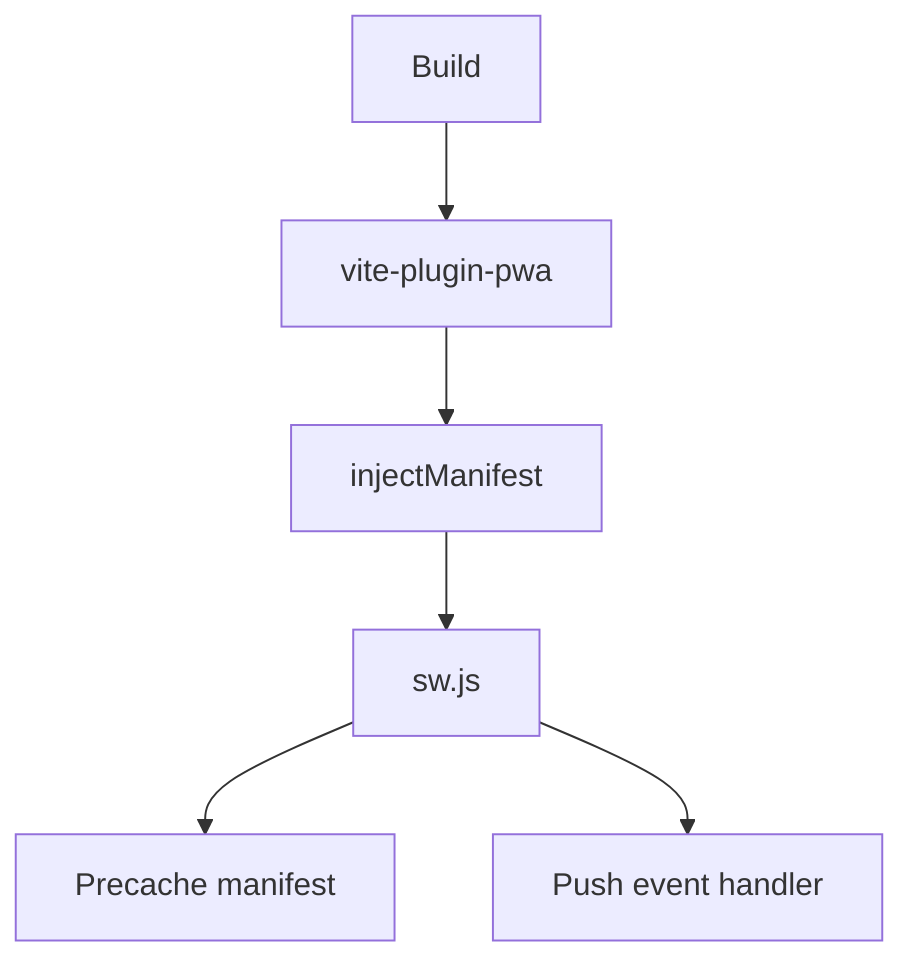

# PWA Architecture

Progressive Web App implementation using Vite's PWA plugin with an injectManifest strategy for full service worker control.

## Build Pipeline



## Service Worker Strategy

The app uses **injectManifest** mode rather than generateSW. This gives full control over the service worker source while letting Workbox inject the precache manifest at build time.

| Concern | Approach |
|---------|----------|
| Mode | `injectManifest` via `vite-plugin-pwa` |
| SW source | `src/sw.ts` compiled to `sw.js` |
| Precaching | All static assets (JS, CSS, HTML, fonts, icons) |
| Runtime caching | None currently (API calls go network-only) |
| Update | Auto-update with `registerSW({ immediate: true })` |

## Precaching

All static assets produced by the Vite build are precached:

- JavaScript bundles (hashed filenames)
- CSS stylesheets
- `index.html`
- Font files (Inter Variable)
- Icon assets (favicon, Apple touch icons, maskable icons)

The precache manifest is injected into `self.__WB_MANIFEST` at build time.

## Code Splitting

Pages are lazy-loaded via React's `lazy()` and `Suspense`. Each page route produces a separate chunk, reducing the initial bundle size and speeding up first paint.

## Push Notifications

The service worker handles push events and notification interactions:

```typescript
self.addEventListener('push', (event) => {
  const data = event.data?.json() ?? {};
  event.waitUntil(
    self.registration.showNotification(data.title ?? 'Task Analytics', {
      body: data.body,
      icon: '/web-app-manifest-192x192.png',
      badge: '/favicon-96x96.png',
      data: { url: data.url ?? '/' },
    })
  );
});

self.addEventListener('notificationclick', (event) => {
  event.notification.close();
  const url = event.notification.data?.url ?? '/';
  event.waitUntil(
    self.clients.matchAll({ type: 'window', includeUncontrolled: true }).then((windowClients) => {
      for (const client of windowClients) {
        if (client.url === url && 'focus' in client) {
          return client.focus();
        }
      }
      return self.clients.openWindow(url);
    })
  );
});
```

Deep linking routes the user to the relevant page when they tap a notification. The `notificationclick` handler first checks for an existing window at that URL before opening a new one.

## Web App Manifest

Key manifest configuration:

```json
{
  "name": "Task Analytics",
  "short_name": "Tasks",
  "display": "standalone",
  "start_url": "/",
  "orientation": "any",
  "theme_color": "#08090a",
  "background_color": "#08090a"
}
```

- `standalone` display removes browser chrome
- Dark theme colors match the app's dark UI
- `orientation: any` supports both portrait and landscape
- `start_url: /` opens to the Week view

## iOS Standalone Mode

Special handling for iOS Safari standalone PWAs:

```html
<meta name="apple-mobile-web-app-capable" content="yes" />
<meta name="apple-mobile-web-app-status-bar-style" content="black-translucent" />
<meta name="viewport" content="..., viewport-fit=cover" />
```

CSS safe area insets prevent content from being obscured by the notch or home indicator:

```css
padding-top: env(safe-area-inset-top);
padding-bottom: env(safe-area-inset-bottom);
padding-left: env(safe-area-inset-left);
padding-right: env(safe-area-inset-right);
```

## Auto-Update Strategy

The service worker is registered inside a `window.addEventListener("load", ...)` callback:

```typescript
window.addEventListener("load", () => {
  registerSW({ immediate: true });
});
```

This ensures users always get the latest version without manual refresh prompts. The `immediate: true` option skips the waiting phase so the new service worker activates immediately.
