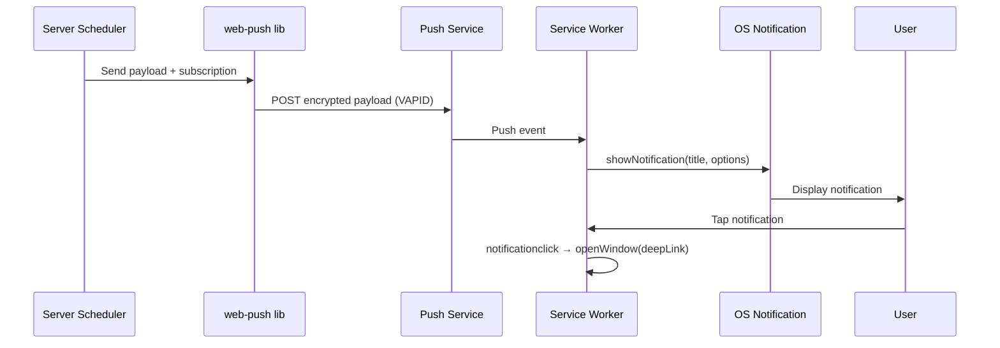

# Push Notification System

Server-initiated push notifications via the Web Push API with VAPID authentication. Delivers timely task reminders, system alerts, and periodic summaries to subscribed devices.

## Overview

The system uses the W3C Push API with VAPID (Voluntary Application Server Identification) for authentication. Notifications are sent from the server without requiring the app to be open, leveraging the service worker's push event handler.

## Notification Types

| Type | Trigger | Default Time | Deep Link | Content Example |
|------|---------|-------------|-----------|-----------------|
| Sync failure | Event-driven | Immediate | `/health` | "Notion sync failed: rate limit exceeded" |
| Sync recovery | Event-driven | Immediate | `/health` | "Sync restored — 12 tasks updated" |
| DB health degradation | Event-driven | Immediate | `/health` | "Database health dropped to 72%" |
| Tasks due today | Scheduled | 08:00 | `/` | "5 tasks due today" |
| Tasks due tomorrow | Scheduled | 08:00 | `/` | "3 tasks due tomorrow — plan ahead" |
| Overdue tasks | Event-driven | On reconciliation | `/` | "2 tasks are now overdue" |
| Daily digest | Scheduled | 07:30 | `/` | "N tasks today, N in progress, N blocked" |
| Weekly review | Scheduled | Sunday 18:00 | `/` | "Week summary: 23 completed, velocity +12%" |
| Blocked task alert | Scheduled | 09:00 (threshold: 3 days) | `/` | "Task X blocked for 3 days" |
| Stale task alert | Scheduled | 09:00 (threshold: 7 days) | `/` | "Task Y unchanged for 7 days" |

## Architecture



## Device Management

Users may subscribe from multiple devices. The system supports:

- **Multi-device subscriptions**: each browser/device registers independently
- **Auto-detected device names**: derived from User-Agent (e.g., "MacBook Safari", "iPhone Chrome")
- **Global defaults**: notification preferences apply to all devices by default
- **Per-device overrides**: individual devices can opt out of specific notification types

## Database Tables

### push_subscriptions

| Column | Type | Constraints | Description |
|--------|------|-------------|-------------|
| id | INTEGER | PRIMARY KEY AUTOINCREMENT | Auto-incrementing ID |
| endpoint | TEXT | UNIQUE | Push service endpoint URL |
| keys_p256dh | TEXT | NOT NULL | Client public key (P-256) |
| keys_auth | TEXT | NOT NULL | Auth secret |
| user_agent | TEXT | | Raw User-Agent string |
| device_name | TEXT | | Auto-detected device label |
| created_at | TEXT | NOT NULL | ISO timestamp |
| last_used_at | TEXT | | Last successful push |

### notification_preferences

| Column | Type | Constraints | Description |
|--------|------|-------------|-------------|
| id | INTEGER | PRIMARY KEY AUTOINCREMENT | Auto-incrementing ID |
| device_id | INTEGER | FK → push_subscriptions.id (nullable) | NULL = global default, else per-device override |
| enabled | INTEGER | NOT NULL | Master toggle (0 or 1) |
| sync_failure | INTEGER | | Toggle for sync failure alerts |
| sync_recovery | INTEGER | | Toggle for sync recovery alerts |
| db_health | INTEGER | | Toggle for DB health alerts |
| tasks_due_today | INTEGER | | Toggle for tasks due today |
| tasks_due_tomorrow | INTEGER | | Toggle for tasks due tomorrow |
| overdue_tasks | INTEGER | | Toggle for overdue task alerts |
| daily_digest | INTEGER | | Toggle for daily digest |
| weekly_review | INTEGER | | Toggle for weekly review |
| blocked_alert | INTEGER | | Toggle for blocked task alerts |
| stale_alert | INTEGER | | Toggle for stale task alerts |
| tasks_due_today_time | TEXT | | Delivery time (HH:MM) |
| tasks_due_tomorrow_time | TEXT | | Delivery time (HH:MM) |
| overdue_tasks_time | TEXT | | Delivery time (HH:MM) |
| daily_digest_time | TEXT | | Delivery time (HH:MM) |
| weekly_review_time | TEXT | | Delivery time (HH:MM) |
| blocked_stale_time | TEXT | | Delivery time (HH:MM) |
| weekly_review_day | INTEGER | | Day of week (0=Sun, 6=Sat) |
| blocked_threshold_days | INTEGER | | Days before blocked alert fires |
| stale_threshold_days | INTEGER | | Days before stale alert fires |

Foreign key: `device_id REFERENCES push_subscriptions(id) ON DELETE CASCADE`

## Scheduler

The notification scheduler uses the **croner** library for cron-based job scheduling:

- Scheduled notifications run as cron jobs (e.g., `0 8 * * *` for 08:00 daily)
- Event-driven notifications fire immediately when their trigger condition is met
- When a user updates their time preferences, affected cron jobs are re-initialized
- The scheduler runs in the same Bun process as the API server

## Settings UI

The notification settings page (`NotificationSettings.tsx`) provides:

- **Master toggle**: enable/disable all push notifications
- **Grouped categories**: System Alerts, Daily Reminders, Periodic Summaries
- **Per-type toggles**: enable/disable individual notification types
- **Time pickers**: customize delivery time for scheduled notifications
- **Per-device overrides**: expand a device section to override global defaults
- **Test notification**: button to send a test push to verify setup

## Environment Variables

| Variable | Description |
|----------|-------------|
| `VAPID_PUBLIC_KEY` | Base64url-encoded public key (shared with client) |
| `VAPID_PRIVATE_KEY` | Base64url-encoded private key (server only) |
| `VAPID_SUBJECT` | Contact URI, e.g., `mailto:admin@example.com` |
| `VITE_VAPID_PUBLIC_KEY` | Same as VAPID_PUBLIC_KEY, exposed to client via Vite |

Generate a VAPID key pair:

```bash
npx web-push generate-vapid-keys
```
