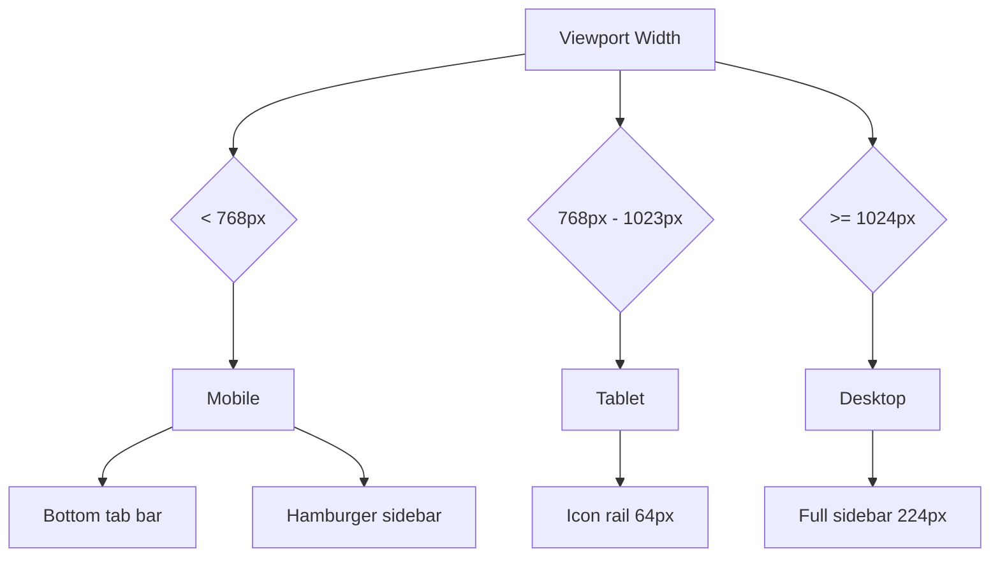

# Responsive Design

Seven-tier breakpoint system with three distinct layout modes, fluid typography, and mobile-first interaction patterns.

## Breakpoint Strategy

| Token | Min Width | Target Devices | Tailwind Class |
|-------|-----------|----------------|----------------|
| base | 0 px | Phones (portrait) | default |
| sm | 640 px | Large phones (landscape) | `sm:` |
| md | 768 px | iPad Mini / small tablets | `md:` |
| lg | 1024 px | iPad Pro / tablets landscape | `lg:` |
| xl | 1280 px | MacBook Air | `xl:` |
| 2xl | 1536 px | MacBook Pro 14" | `2xl:` |
| 3xl | 1920 px | Full HD desktop | `3xl:` |

Ultra-wide displays are capped at `3xl:max-w-[1600px]` centered with auto margins to prevent excessive line lengths.

## Layout Modes



### Mobile (< 768px)

- **BottomTabBar**: fixed at bottom, 4 primary tabs (Week, Trends, Prioritize, Health)
- **MobileSidebar**: hamburger-triggered overlay with all 6 pages
- Content fills full viewport width
- Bottom sheet pattern for popovers and date pickers

### Tablet (768px - 1023px)

- **IconRail**: 64px fixed left column with all 6 navigation icons
- No labels; tooltip on hover/long-press
- Content area fills remaining width

### Desktop (>= 1024px)

- **Sidebar**: 224px fixed left panel with icons and text labels
- All 6 pages visible with active state indicator
- Content area has comfortable margins

## Navigation Structure

| Component | Visible At | Items | Behavior |
|-----------|-----------|-------|----------|
| BottomTabBar | Mobile | 4 tabs: Week, Trends, Prioritize, Health | Fixed bottom, `calc(49px + env(safe-area-inset-bottom))` height |
| MobileSidebar | Mobile | All 6 pages | Overlay from left, backdrop blur |
| IconRail | Tablet | All 6 icons | Fixed left, 64px width |
| Sidebar | Desktop | All 6 with labels | Fixed left, 224px width |

## Fluid Typography

Font sizes scale smoothly between breakpoints using `clamp()`:

| Role | Min | Preferred | Max | Usage |
|------|-----|-----------|-----|-------|
| display | 1.75rem | 2.5vw | 2.25rem | Dashboard greeting |
| page-heading | 1.375rem | 2vw | 1.75rem | Page titles |
| section-title | 1.125rem | 1.5vw | 1.375rem | Card group headings |
| body | 0.875rem | 1vw | 1rem | Default text |
| small | 0.75rem | 0.8vw | 0.8125rem | Captions, timestamps |

## Touch Targets

All interactive elements maintain a minimum touch target of **44px** (per WCAG 2.5.5):

- Buttons use `min-h-[44px] min-w-[44px]`
- Icon buttons expand hit area with padding
- List items use adequate vertical padding
- Bottom tab bar icons have 44px tap zones

## Safe Area Handling

Environment variables ensure content is not obscured by device hardware (notch, home indicator, rounded corners):

```css
padding-top: env(safe-area-inset-top);
padding-bottom: env(safe-area-inset-bottom);
padding-left: env(safe-area-inset-left);
padding-right: env(safe-area-inset-right);
```

The bottom tab bar adds `env(safe-area-inset-bottom)` to its height on iOS standalone mode.

## Container Queries (Future)

Chart widgets will adopt container queries (`@container`) to adapt their internal layout based on available card width rather than viewport width. This enables consistent chart rendering regardless of sidebar state or grid column count.

## Bottom Sheet Pattern

On mobile viewports, popovers and secondary actions use a bottom sheet instead of dropdown menus:

- Slides up from bottom with spring animation
- Backdrop overlay dismisses on tap
- Drag handle for swipe-to-dismiss
- Respects safe area inset at bottom
- Used for: date pickers, filter panels, task detail actions
