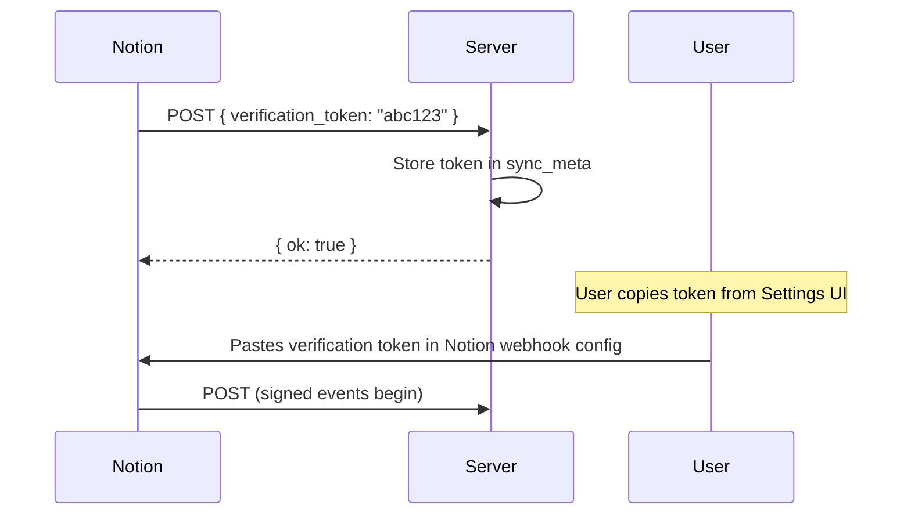

# Webhook Handler

Receives real-time page events from Notion with HMAC-SHA256 signature verification.

**Source:** `app/server/sync/webhook.ts`

**Endpoint:** `POST /api/webhooks/notion` (exempt from bearer token auth)

## Verification Flow

Before Notion sends live events, it performs a one-time verification handshake:



1. Notion sends `{ verification_token: "..." }` (no `type` field)
2. Server stores token as `webhook_verification_token` in `sync_meta`
3. Token is displayed in the Settings page UI for the user to copy back to Notion
4. Once Notion confirms, all subsequent requests include HMAC signatures

## HMAC Signature Verification

Every post-verification webhook request includes an `X-Notion-Signature` header:

```
X-Notion-Signature: sha256=<hex-digest>
```

Verification process:
1. Compute SHA-256 HMAC of the raw request body using the stored verification token as the secret
2. Compare the computed hash to the signature header (timing-safe comparison via `crypto.timingSafeEqual`)
3. Reject with 401 if mismatch

```typescript
function verifySignature(body: string, signature: string, secret: string): boolean {
  const hmac = new Bun.CryptoHasher("sha256", secret);
  hmac.update(body);
  const expected = hmac.digest("hex");
  const actual = signature.startsWith("sha256=") ? signature.slice(7) : signature;
  return timingSafeEqual(Buffer.from(expected), Buffer.from(actual));
}
```

## Event Processing

### Supported Event Types

| Event Type | Action |
|-----------|--------|
| `page.deleted` | `softDeletePage(db, pageId)` — marks page as deleted |
| `page.undeleted` | `restorePage(db, pageId)` — clears deleted_at, then re-fetches and upserts |
| `page.created` | Fetches full page from API, upserts into SQLite |
| `page.updated` | Fetches full page from API, upserts into SQLite |

### Database Identification

When a webhook event arrives, the handler must determine which typed table (tasks/projects/areas) the page belongs to. Resolution order:

1. **Check existing record** — query `pages` table for the page ID
2. **Check event payload** — look for `data.parent.id` matching a known DATA_SOURCE UUID
3. **Check fetched page** — examine `parent.data_source_id` or `parent.database_id` in the fetched response

Uses `REVERSE_DATA_SOURCES` map (UUID -> database key, with hyphens stripped for comparison).

### Processing Flow

```typescript
async function processWebhookEvent(db, apiKey, event) {
  const pageId = event.entity?.id;
  
  if (eventType === "page.deleted") -> softDeletePage(db, pageId); return;
  if (eventType === "page.undeleted") -> restorePage(db, pageId);
  
  // Identify database
  databaseId = determineDatabaseId(pageId, db)
    || fromEventPayload(event)
    || fromFetchedPage(page);
  
  // Fetch and upsert
  const page = await fetchPage(apiKey, pageId);
  upsertPage(db, { id: page.id, database_id: databaseId, raw_json: JSON.stringify(page), ... });
}
```

## Error Handling

- All errors are caught and logged to `sync_events` with `event_type: "error"`
- The handler always returns `{ ok: true }` (200) to Notion regardless of processing errors — this prevents Notion from retrying and creating duplicate processing
- If the webhook is not yet verified, returns 503

## Metadata Updates

On successful event processing:
- `last_webhook` -> current ISO timestamp
- Event logged with type and entity ID
