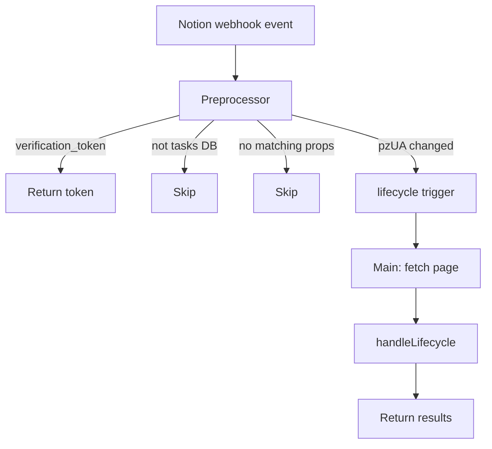

# Tasks Webhook Router

Shared Notion webhook endpoint for the Tasks database. Routes property change events to the appropriate handler based on which property was modified.

## Overview

| Attribute | Value |
|-----------|-------|
| **Script** | `f/notion_tasks/tasks_webhook_router` |
| **Trigger** | HTTP POST (Notion webhook) |
| **Route** | `notion/webhook/tasks` |
| **Endpoint** | `https://windmill-production-8a72.up.railway.app/api/r/notion/webhook/tasks` |
| **Runtime** | Bun (Windmill) |

This script acts as a single entry point for all Tasks database webhooks, dispatching to the lifecycle handler.

## Architecture

## Preprocessor

The preprocessor filters events before the main function executes, avoiding unnecessary Notion API calls:

1. **Verification handshake** — If payload contains `verification_token`, return it immediately (one-time Notion webhook setup)
2. **Event type check** — Only process `page.properties_updated` events
3. **Database check** — Validate `data.parent.id` matches the Tasks database (normalized UUID comparison)
4. **Property filter** — Check `data.updated_properties` for relevant property IDs:
   - `pzUA` (Status) → trigger `lifecycle` handler
5. **Extract page ID** from `entity.id`

Events that don't match any handler are skipped silently (no error, no Notion API call).

## Handlers

### Lifecycle Handler

Manages `Started Date` and `Closed Date` based on status transitions. See [[Task Lifecycle]] for the complete transition table.

**Logic:**
- **→ In Progress:** Set Started Date if empty. Clear Closed Date if set.
- **→ Done / Cancelled:** Set Closed Date if empty. Set Started Date if empty.
- **→ Not Started:** Clear both (full reset).
- **→ Blocked:** No date changes.

Dates are only set when currently empty — prevents overwriting a legitimate earlier value.

## Bounce-Back Prevention

Writing to `Started Date` or `Closed Date` triggers a new `page.properties_updated` webhook from Notion. However, those property IDs are *not* `pzUA`, so the preprocessor will skip the event (no matching triggers). No infinite loop possible.

## Concurrency

The router processes one handler per event. Both the preprocessor filter and handler write to non-overlapping properties, so no conflict arises.

## Configuration

| Constant | Value | Purpose |
|----------|-------|---------|
| `TASKS_DATABASE_ID` | `a43c2d3d-...` | Stable database container ID |
| `STATUS_PROP_ID` | `pzUA` | Notion property ID for "Status" |

The Notion API token is fetched at runtime from Windmill resource `f/notion/api`.

## Timezone

All dates are computed in **Asia/Shanghai (CST, UTC+8)** using the `getTodayCST()` helper. This ensures consistency with the user's local date regardless of the Windmill worker's system timezone.
