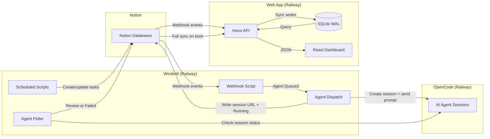

# Architecture

## Monorepo Structure

```
my-task-management/
├── app/            # Full-stack web application
│   ├── server/     # Hono API + SQLite + sync engine
│   └── src/        # React 19 SPA (Vite)
├── automation/     # Windmill scripts (Notion task automation)
│   └── f/          # Windmill resource tree
└── docs/           # This documentation vault
```

## Data Flow Overview



## App Architecture

The web application runs on **Bun** with:

- **Hono 4.x** — Lightweight HTTP framework serving both API routes and the static SPA
- **SQLite (bun:sqlite)** — Embedded database in WAL mode for concurrent reads during writes
- **React 19 SPA** — Client-side dashboard built with Vite 8, served as static assets
- **Single-binary deployment** — Multi-stage Docker build produces a slim Bun container

### Three-Layer Sync Strategy

| Layer | Trigger | Purpose |
|-------|---------|---------|
| Full sync | App boot | Hydrate SQLite from Notion — complete source of truth |
| Reconciliation | Every 15 minutes | Catch missed webhooks, repair drift |
| Webhooks | Real-time (Notion push) | Immediate updates for task changes |

## Automation Architecture

Windmill CE runs on Railway with **6 scripts** (1 active webhook, 3 scheduled/async, 1 disabled):

| Script | Trigger | Purpose |
|--------|---------|---------|
| `tasks_webhook_router` | Webhook (Notion) | Routes property changes; sets lifecycle dates (Started/Closed); triggers agent dispatch |
| `dispatch_agent_task` | Async job (from router) | Creates OpenCode session, sends intake prompt, writes session URL to Notion |
| `poll_agent_sessions` | Cron (every 2 min) | Detects idle OpenCode sessions; sets Agent → Review or Failed |
| `create_repetitive_tasks` | Cron (daily) | Generate recurring tasks from config database |
| `create_weekly_note` | Cron (weekly) | Create weekly planning page |
| `update_legacy_tasks` | **Disabled** | Formerly rolled overdue tasks forward (retired — replaced by view-based filtering) |

Scripts run in **Bun runtime** within Windmill workers and interact with the Notion API (v2025-09-03).

The `dispatch_agent_task` and `poll_agent_sessions` scripts are part of the [[Agent Orchestration]] system — see that section for the full design.

## OpenCode Worker Architecture

The hosted OpenCode worker is deployed on Railway from the separate
`geoffyli/my-harness` repo, under `cloud/opencode/`. This repo owns the
Windmill dispatch and polling scripts; `my-harness` owns the OpenCode cloud
profile, including:

- `AGENTS.md` worker rules
- `opencode.jsonc` permissions, model, and MCP servers
- curated skill bundle
- Railway health proxy and start command

The worker installs its config globally into `/root/.config/opencode/` on
startup. Its current MCP servers are Notion and GitHub.

## Key Design Decisions

- **SQLite over Postgres** — Single-node deployment, simpler ops, WAL mode handles the read-heavy dashboard workload.
- **Event-driven sync** — Webhooks provide near-real-time updates; reconciliation handles edge cases.
- **Monorepo** — Shared documentation and coordinated deployment for tightly coupled systems.
