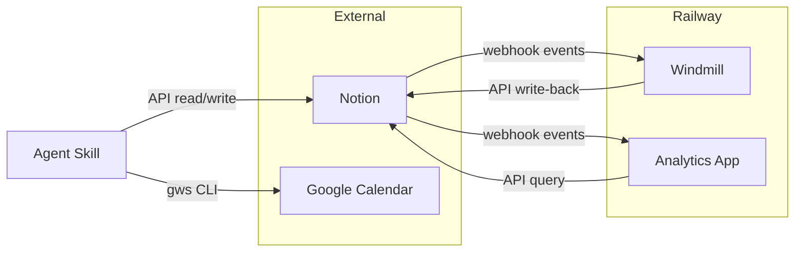

# Component Map

The task management system consists of 5 components that together handle task storage, automation, analytics, and reminders.

## Components

| # | Component | Role | Owns |
|---|-----------|------|------|
| 1 | **Notion Workspace** | Source of truth | Tasks, Projects, Areas, Repetitive Tasks Config, Weekly Notes |
| 2 | **Windmill Automation** | Event-driven + scheduled automation | Lifecycle date logic, recurring task generation, weekly note creation |
| 3 | **Analytics App** | Sync engine, API, and dashboard | SQLite mirror, metrics computation, visualization |
| 4 | **Agent Skill** | AI agent interface | Operation rules, schemas, and safety constraints |
| 5 | **Google Calendar** | Reminder system | Single-action time-bound reminders |

## Component Boundaries

### Notion Workspace

- **Type:** External SaaS (source of truth)
- **Exposes:** Webhook events (property changes), REST API (query/create/update pages)
- **Consumes:** Write-backs from Windmill (lifecycle dates, repetitive tasks), queries from App (sync)
- **Data:** 5 active databases (Tasks, Projects, Areas, Repetitive Tasks Config, Weekly Notes)

### Windmill Automation

- **Type:** Automation platform on Railway
- **Exposes:** HTTP webhook endpoint (`POST /notion/webhook/tasks`)
- **Consumes:** Notion webhook events, Notion API (read pages, write properties)
- **Scripts:** 3 active (webhook router, repetitive tasks cron, weekly note cron)
- **Timezone:** Asia/Shanghai (UTC+8)

### Analytics App

- **Type:** Full-stack web app on Railway (Bun + Hono + SQLite + React)
- **Exposes:** REST API (`/api/tasks`, `/api/projects`, `/api/areas`, `/api/status`), webhook endpoint (`POST /api/webhooks/notion`)
- **Consumes:** Notion webhook events, Notion API (full sync + reconciliation queries)
- **Sync:** Three-layer (full on boot, reconciliation every 15 min, webhooks real-time)

### Agent Skill

- **Type:** Documentation + rules (lives in `skill/` directory)
- **Exposes:** Operational guide for AI agents (schemas, CRUD operations, safety rules)
- **Consumes:** Notion API (via agent tool calls), Google Calendar API (via `gws` CLI)
- **Scope:** Read/write tasks, projects, areas; create calendar reminders

### Google Calendar

- **Type:** External SaaS (reminder layer)
- **Exposes:** Calendar events with popup notifications
- **Consumes:** Event creation from agent operations
- **Account:** geoff.yulong.li@gmail.com (primary calendar)

## Interface Matrix

| From | To | Protocol | Purpose |
|------|------|----------|---------|
| Notion | Windmill | Webhook POST | Task property change events |
| Notion | App | Webhook POST | Page create/update/delete events |
| Windmill | Notion | REST API | Write lifecycle dates, create tasks/notes |
| App | Notion | REST API | Query pages (full sync + reconciliation) |
| Agent Skill | Notion | REST API | CRUD operations on user request |
| Agent Skill | Google Calendar | gws CLI | Create/manage reminder events |

## Key Invariants

- Notion is always the source of truth — other components derive state from it
- Windmill and App receive webhooks independently (separate endpoints, separate purposes)
- Windmill writes *back to Notion* (lifecycle dates); App only *reads from Notion*
- The Agent Skill can both read and write Notion, but only on explicit user request with confirmation
- Google Calendar is write-only from the system's perspective (no sync back to Notion)
