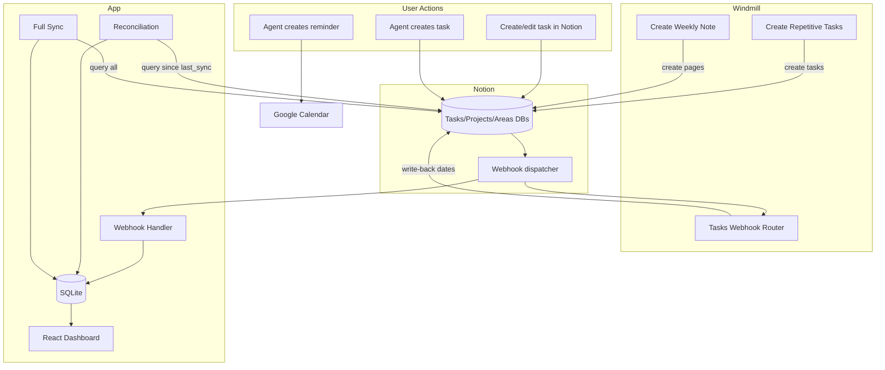

# Data Flow

End-to-end data paths showing how information moves through the system for each major operation.

## Overview

## Flow 1: Task Update (User edits in Notion)

The most common flow. User changes a task property (status, assigned date) in Notion.

| Step | Component | Action |
|------|-----------|--------|
| 1 | Notion | User updates task property |
| 2 | Notion | Fires webhook to **both** Windmill and App |
| 3a | Windmill | `tasks_webhook_router` preprocessor checks property IDs |
| 3b | App | Webhook handler verifies HMAC signature |
| 4a | Windmill | Fetches page, runs lifecycle handler, writes dates back to Notion |
| 4b | App | Fetches page, upserts to SQLite |
| 5 | Notion | Windmill write-back triggers another webhook (but preprocessor skips non-matching properties) |
| 6 | App | Dashboard reflects updated data |

**Key detail:** Steps 3a/4a and 3b/4b happen in parallel — Windmill and App process the same webhook event independently.

## Flow 2: Task Creation (Manual)

User creates a new task in Notion with an Assigned Date.

| Step | Component | Action |
|------|-----------|--------|
| 1 | Notion | User creates task page, sets Assigned Date |
| 2 | Notion | Fires `page.created` + `page.properties_updated` webhooks |
| 3 | App | Receives `page.created`, fetches page, inserts into SQLite |

## Flow 3: Repetitive Task Creation (Automated)

Daily cron generates recurring tasks from the config database.

| Step | Component | Action |
|------|-----------|--------|
| 1 | Windmill | `create_repetitive_tasks` fires at midnight CST |
| 2 | Windmill | Queries Repetitive Tasks Config DB for active entries |
| 3 | Windmill | Evaluates cron/interval conditions against today |
| 4 | Windmill | Creates task in Notion (with template blocks if configured) |
| 5 | Notion | New task triggers webhooks |
| 6 | App | Picks up new task via webhook or next reconciliation |

## Flow 4: Weekly Note Creation (Automated)

Monday cron creates a planning page.

| Step | Component | Action |
|------|-----------|--------|
| 1 | Windmill | `create_weekly_note` fires Monday midnight CST |
| 2 | Windmill | Calculates ISO week number and date range |
| 3 | Windmill | Creates page in Weekly Notes DB with 7-day structure |

## Flow 5: Dashboard Read (User views analytics)

| Step | Component | Action |
|------|-----------|--------|
| 1 | App | React SPA requests `/api/tasks`, `/api/projects`, `/api/areas` |
| 2 | App | Hono queries SQLite (denormalized tables) |
| 3 | App | Returns JSON to frontend |
| 4 | App | Client-side `lib/metrics.ts` computes throughput, velocity, aging, etc. |

## Flow 6: Google Calendar Reminder (Agent-created)

| Step | Component | Action |
|------|-----------|--------|
| 1 | Agent Skill | User requests a reminder |
| 2 | Agent Skill | Confirms with user, then calls `gws calendar event create` |
| 3 | Google Calendar | Event created with popup notification at specified lead time |

## Data Freshness

| Path | Latency | Mechanism |
|------|---------|-----------|
| Notion → App (webhook) | ~1-5 seconds | Real-time push |
| Notion → App (reconciliation) | Up to 15 minutes | Polling interval |
| Notion → App (full sync) | On boot only | Complete refresh |
| Notion → Windmill (webhook) | ~1-3 seconds | Real-time push |
| Windmill → Notion (write-back) | ~1-2 seconds | API call after processing |

## Data Ownership

| Data | Owner | Consumers |
|------|-------|-----------|
| Task/Project/Area records | Notion | All components (read) |
| Lifecycle dates (Started, Closed) | Windmill (writes) | Notion (stores), App (reads) |
| Repetitive task instances | Windmill (creates) | Notion (stores), App (reads) |
| Analytics metrics | App (computes) | React dashboard (displays) |
| Sync state (last_sync_time, events) | App | App (internal) |
| Calendar reminders | Google Calendar | User (notifications) |
