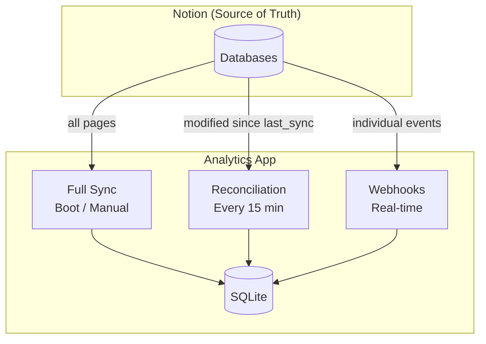

# Sync Strategy

How data stays consistent across components. The system uses a multi-layer approach to ensure the Analytics App's SQLite mirror accurately reflects Notion's state, while Windmill handles automation write-backs independently.

## Design Principle

Notion is the single source of truth. All other components derive their state from it. No component writes data that contradicts Notion — they either read from it or write back to it (never to each other directly).

## App Sync: Three Layers

The Analytics App maintains a local SQLite copy of Notion data using three complementary sync mechanisms:

| Layer | When | Scope | Latency | Purpose |
|-------|------|-------|---------|---------|
| **Full Sync** | Boot (if DB empty) or manual trigger | All pages from all 3 databases | Minutes | Baseline truth, disaster recovery |
| **Reconciliation** | Every 15 minutes | Pages modified since `last_sync_time` | Seconds per batch | Catch missed webhooks, repair drift |
| **Webhooks** | Real-time (Notion push) | Single page per event | 1-5 seconds | Immediate updates for active editing |

### Why Three Layers?

- **Full sync alone** would be too slow for real-time display
- **Webhooks alone** are unreliable (network issues, downtime, missed events)
- **Reconciliation alone** creates up to 15-minute lag
- Together: webhooks handle the 99% case, reconciliation catches the 1% edge cases, full sync provides a reset mechanism

### Consistency Guarantees

- **Eventual consistency** with Notion (bounded by reconciliation interval)
- **At-least-once processing** for webhooks (deduplication via upsert)
- **Mutex protection** prevents concurrent sync operations from conflicting
- **Soft deletes** preserve audit trail (deleted pages marked, not removed)

## Windmill Sync: Push/Pull Scripts

Windmill automation scripts follow a different model — they don't maintain a local copy. They read from and write to Notion directly via API.

| Script | Sync Pattern | Direction |
|--------|-------------|-----------|
| `tasks_webhook_router` | Event-driven | Read page → Write dates back |
| `create_repetitive_tasks` | Scheduled (daily) | Read config DB → Write new tasks |
| `create_weekly_note` | Scheduled (weekly) | Write new page |

Windmill scripts are **stateless** — they don't maintain local databases. Each execution reads fresh data from Notion and writes back immediately.

## Conflict Avoidance

Since multiple components write to Notion, conflicts must be prevented:

| Scenario | Prevention Mechanism |
|----------|---------------------|
| Windmill and user edit same property | Windmill only writes lifecycle dates (auto-managed), user controls other properties — non-overlapping |
| App and Windmill both process same webhook | They serve different purposes (App mirrors, Windmill automates) — no conflict |
| Repetitive task duplicate creation | Duplicate check queries Tasks DB before creating |
| Concurrent full sync + reconciliation | Mutex flag (`syncing` boolean) — reconciliation skips if full sync running |

## Failure Modes

| Failure | Impact | Recovery |
|---------|--------|----------|
| Webhook endpoint down (App) | Dashboard stale | Reconciliation catches up within 15 min |
| Webhook endpoint down (Windmill) | Lifecycle dates not set | Manual trigger or wait for next matching event |
| Notion API outage | All components stall | Retry on next scheduled run / webhook |
| SQLite corruption | Dashboard unavailable | Delete DB file, restart → full sync rebuilds |
| Reconciliation misses pages | Stale data for up to 30 min | Next reconciliation pass picks them up |

## Metadata Tracking

The App tracks sync state in the `sync_meta` table:

| Key | Purpose |
|-----|---------|
| `last_full_sync` | When the last complete sync finished |
| `last_reconciliation` | When the last incremental pass ran |
| `last_webhook` | When the last webhook was processed |
| `last_sync_time` | "Since" filter for reconciliation queries |
| `webhook_verification_token` | HMAC secret for signature validation |
