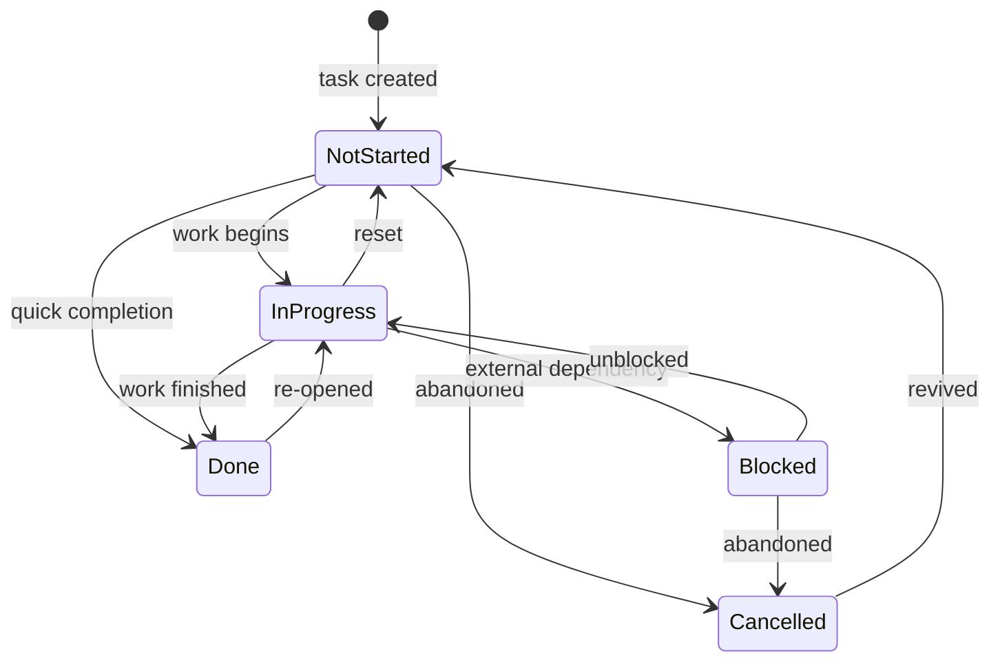

# Task Lifecycle

The task lifecycle defines how a task moves through states from creation to completion, what timestamps are captured at each transition, and how the system automates date tracking without manual effort.

## State Machine

A task exists in exactly one of five states:



| State | Meaning | Behavior |
|-------|---------|----------|
| **Not Started** | Planned but no work has begun | Default for new tasks. Appears in scheduling views. |
| **In Progress** | Actively being worked on | Counts toward WIP. Triggers Started Date automation. |
| **Blocked** | Cannot proceed due to external factor | Excluded from auto-rescheduling. Still counts as active. |
| **Done** | Successfully completed | Terminal state. Triggers Closed Date automation. |
| **Cancelled** | Abandoned without completion | Terminal state. Triggers Closed Date automation. |

**Design principle:** Any transition is permitted. The system does not enforce a strict forward-only flow because personal task management requires flexibility (re-opening, resetting, changing course). Instead, the automation layer captures *when* transitions happen for analytical value.

## Lifecycle Dates

Each task carries four date fields that together tell the complete planning-to-completion story:

```
Initial Assigned Date → Assigned Date → Started Date → Closed Date
     (first intent)      (current plan)   (execution)    (completion)
```

| Field | Set by | Mutability | Purpose |
|-------|--------|-----------|---------|
| **Initial Assigned Date** | Webhook (first time Assigned Date is populated) | Immutable — never cleared or overwritten | Records when you *first intended* to do this task. Enables planning accuracy metrics. |
| **Assigned Date** | User (manual) | User-controlled | The day the task is scheduled for. Only changes on intentional reschedule. Powers the Today view. |
| **Started Date** | Webhook (status → In Progress) | Auto-managed — cleared on reset to Not Started | When execution actually began. Enables cycle time analysis. |
| **Closed Date** | Webhook (status → Done or Cancelled) | Auto-managed — cleared on re-open | When the task left the active pool. Enables accurate throughput tracking. |

Supporting system fields (not managed by lifecycle automation):
- **Deadline** — Hard due date (manual, optional)
- **created_time** — Notion system timestamp (immutable)
- **last_edited_time** — Notion system timestamp (auto-updated)

## Date Automation Rules

A webhook router monitors the Status property. On each status change:

| Transition | Started Date | Closed Date |
|-----------|-------------|-------------|
| → In Progress | Set to today (if empty) | Clear (if set) |
| → Done | Set to today (if empty) | Set to today (if empty) |
| → Cancelled | Set to today (if empty) | Set to today (if empty) |
| → Not Started | Clear | Clear |
| → Blocked | No change | No change |

**Key behaviors:**
- Dates are only *set* if currently empty — prevents overwriting a legitimate earlier date
- Going to Not Started is a full reset (clears both dates)
- Going to Blocked preserves all dates (the task is paused, not reset)
- Done and Cancelled both set Closed Date — "closed" means left the active pool regardless of outcome

A separate handler monitors the Assigned Date property:
- When Assigned Date is first populated → set Initial Assigned Date (one-time, immutable)
- Once Initial Assigned Date exists → no further action, regardless of Assigned Date changes

## Today View

The daily task view uses a Notion database filter rather than date mutation:

```
Assigned Date ≤ today  AND  Status not in {Done, Blocked, Cancelled}
```

This means:
- Tasks scheduled for today or earlier appear in the view
- Overdue tasks naturally accumulate (they have past Assigned Dates)
- No nightly automation modifies task dates
- Original scheduling intent is always preserved

**Design rationale:** A previous approach (nightly rollover script) mutated Assigned Date to today for all overdue tasks. This was retired because it destroyed scheduling history, inflated reschedule metrics, and created unnecessary API/webhook churn. The view-based approach achieves the same UX with zero automation cost.

## Analytics Dependencies

The lifecycle dates power these key metrics:

| Metric | Dates Used | What It Measures |
|--------|-----------|-----------------|
| **Throughput** | Closed Date (week bucketed) | Tasks completed per week |
| **Velocity** | Closed Date (4-week rolling avg) | Completion rate trend |
| **Planning Accuracy** | Assigned Date vs. Closed Date | Did you finish when you planned? |
| **Reschedule Slip** | Initial Assigned Date vs. Assigned Date | How far did the task drift from original plan? |
| **Task Age** | created_time vs. today | How long has this been open? |
| **Cycle Time** | Started Date → Closed Date | Time from first work to completion |
| **Burndown** | created_time (birth) + Closed Date (exit) | Open task count over time |

**Fallback logic:** For historical tasks that predate the webhook (no Closed Date), analytics fall back to Assigned Date as a proxy. This ensures continuity with pre-automation data.

## Design Decisions

**Why five states (not fewer)?**
Three states (To Do / Doing / Done) is the minimum viable. We add Blocked and Cancelled because each triggers a *different behavior*: Blocked means "I can't act — wait for something external," while Cancelled means "this will never be done." Without these distinctions, blocked tasks clutter the active list and cancelled tasks inflate failure metrics.

**Why Closed Date covers both Done and Cancelled?**
Both represent leaving the active pool. Analytics care about *when* a task stopped being open, not *why*. The Status field already distinguishes outcome.

**Why Initial Assigned Date is immutable?**
It answers a single question: "When did I first plan to do this?" If it were mutable, it would become indistinguishable from Assigned Date. Its value comes entirely from being a frozen snapshot of original intent.

**Why view-based filtering over automated rollover?**
Mutating data for presentation purposes is an anti-pattern. The view achieves the same UX (showing relevant tasks today) without side effects. It also produces better analytics: a task sitting for 7 days with its original Assigned Date clearly signals "ignored for a week" — information destroyed by nightly rollover.
