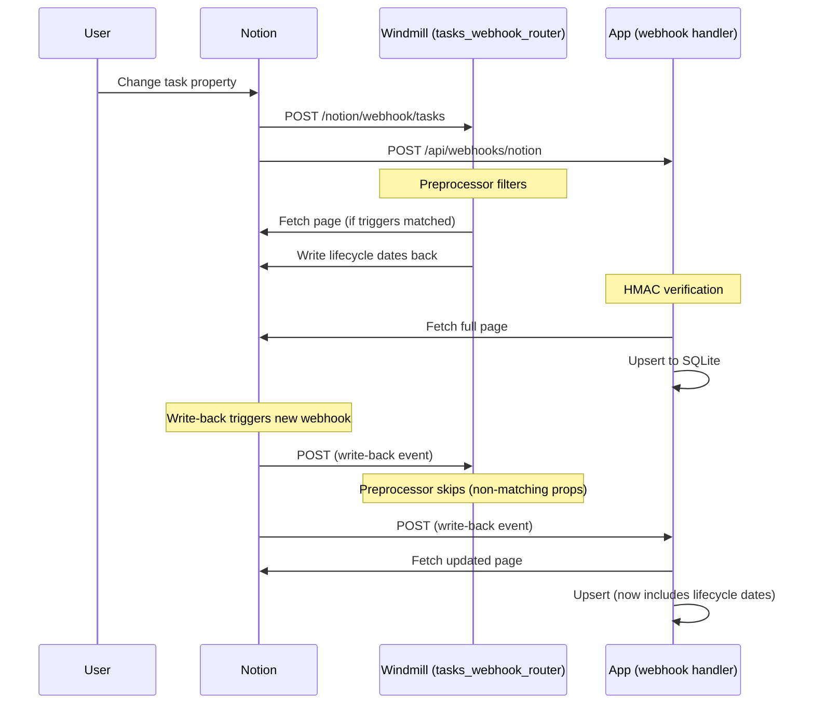

# Webhook Flow

Cross-cutting trace of the webhook pipeline from Notion through Windmill and the Analytics App. Use this document when debugging webhook-related issues or planning changes to event processing.

## Pipeline Overview

When a task property changes in Notion, **two independent webhook pipelines** fire in parallel:

## Pipeline 1: Windmill (Automation)

**Endpoint:** `POST https://windmill-production-8a72.up.railway.app/api/r/notion/webhook/tasks`

**Purpose:** Automate lifecycle date management (Started Date, Closed Date)

**Processing steps:**

1. **Verification check** — If payload has `verification_token`, return it (one-time setup)
2. **Event type filter** — Only process `page.properties_updated`
3. **Database filter** — Validate parent matches Tasks database UUID
4. **Property filter** — Check `data.updated_properties` for:
   - `pzUA` (Status) → triggers lifecycle handler
5. **Page fetch** — GET the full page from Notion API
6. **Handler execution** — Run matched handlers in parallel (`Promise.all`)
7. **Write-back** — PATCH lifecycle date properties on the task page

**Bounce-back safety:** The write-back to lifecycle date properties (`Started Date`, `Closed Date`) triggers a new webhook from Notion. But those property IDs don't match `pzUA`, so the preprocessor skips them. No infinite loop.

## Pipeline 2: Analytics App (Sync)

**Endpoint:** `POST <app-url>/api/webhooks/notion`

**Purpose:** Keep SQLite mirror up-to-date in real-time

**Processing steps:**

1. **Verification check** — If payload has `verification_token`, store it and return
2. **HMAC verification** — Validate `X-Notion-Signature` header using stored token
3. **Event routing:**
   - `page.deleted` → soft-delete in SQLite
   - `page.undeleted` → restore + re-fetch
   - `page.created` / `page.updated` → fetch + upsert
4. **Database identification** — Determine which table (tasks/projects/areas) via parent UUID lookup
5. **Page fetch** — GET full page from Notion API
6. **Upsert** — Write to `pages` (raw JSON) + denormalized table (tasks/projects/areas)
7. **Audit log** — Record event in `sync_events`

**Error handling:** Always returns `{ ok: true }` to Notion regardless of processing errors. This prevents Notion from retrying and creating duplicate events.

## Webhook Registration

Both endpoints require one-time registration with Notion:

| Aspect | Windmill | App |
|--------|----------|-----|
| Verification | Returns `verification_token` from payload | Stores token in `sync_meta`, shows in Settings UI |
| Auth method | Payload-level token exchange | HMAC-SHA256 signature on every subsequent request |
| Retry behavior | N/A (no auth after verification) | Returns 200 always (prevents retries) |

## Debugging Guide

| Symptom | Check |
|---------|-------|
| Lifecycle dates not updating | Windmill logs → preprocessor skipping? Wrong property ID? API error? |
| Dashboard not reflecting changes | App webhook status in Settings → HMAC failing? 503 (not yet verified)? |
| Infinite webhook loop | Should not happen (bounce-back prevention). If suspected: check Windmill logs for repeated processing of same page |
| Delay in dashboard updates | If webhook is down, reconciliation catches up within 15 minutes |
| New database not syncing | Check `DATA_SOURCES` in App + `TASKS_DATABASE_ID` in Windmill |

## Affected Components by Change Type

| Change | Windmill Impact | App Impact |
|--------|----------------|------------|
| Add new lifecycle date | Modify handler logic | Add column to tasks table, update property mapping |
| Add new database | N/A (only watches Tasks) | Add to `DATA_SOURCES`, create table, add sync logic |
| Change webhook endpoint URL | Update Notion webhook config | Update Notion webhook config |
| Add new task property | N/A (unless triggers automation) | Update property mapping + denormalization |
